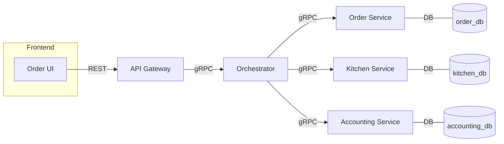
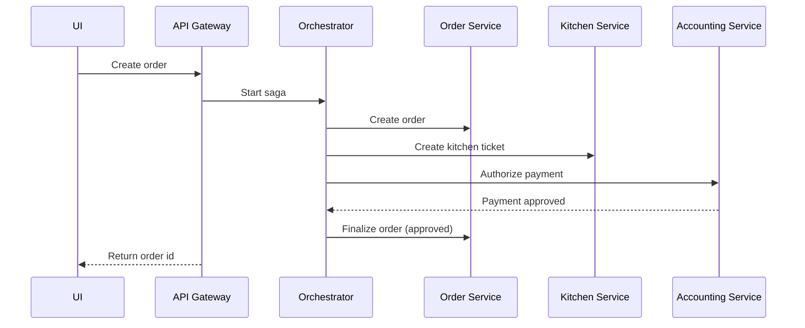

#  Gourmet-Go Distributed Order System 🍽️

## Project Overview

- **Project name:**  Gourmet-Go Distributed Order System
- **Short description:** A microservices demonstration of distributed transactions using the Saga pattern. The system simulates an order lifecycle (order creation, kitchen ticketing, payment) and exposes a dynamic, backend-driven Saga timeline in the frontend.
- **Main objectives:**
  - Implement and visualize Saga workflows driven by actual backend events (no mock data).
  - Demonstrate compensation/rollback flows for failure scenarios.
  - Provide a reproducible Docker-powered development stack for testing and evaluation.
- **Technologies used:** Java, Spring Boot, gRPC / Protobuf, Maven, PostgreSQL, Angular (TypeScript), Docker, Docker Compose, RxJS.
- **Architecture style:** Microservices with Saga orchestration (orchestrator + API Gateway aggregation).
- **Why this architecture:** Microservices separate concerns per business capability (orders, kitchen, accounting). The Saga pattern coordinates distributed transactions without a global two-phase commit, enabling eventual consistency and explicit compensation flows suited for long-running operations across services.

---

## System Architecture

This repository contains the following services and responsibilities:

- **API Gateway** (module: `api-gateway`)
  - REST façade for the frontend.
  - Aggregates snapshots from service databases to build `OrderStatusDTO` including a `steps[]` array (the Saga timeline).
  - Exposes endpoints used by the UI.

- **Order Service** (module: `order-service`)
  - Manages order lifecycle and finalization.
  - Persists `orders` table; exposes order creation/finalization logic.

- **Kitchen Service** (module: `kitchen-service`)
  - Creates/approves/rejects kitchen tickets.
  - Persists `tickets` table and sets `updated_at` on status changes.

- **Accounting / Payment Service** (module: `accounting-service`)
  - Handles payment validation and approval/rejection.
  - Persists `payments` table and sets `updated_at` on status changes.

- **Orchestrator** (module: `orchestrator`)
  - Coordinates Saga execution using gRPC / protobuf messages (service-to-service orchestration client).

Services communicate using a mix of:

- gRPC/protobuf for orchestration calls between orchestrator and services (proto module contains protobuf definitions).
- REST (HTTP) between frontend and API Gateway.
- Each service owns its own PostgreSQL database (Database-per-service pattern). The API Gateway reads snapshots from those databases to build the timeline.

Request lifecycle (simplified):

1. Frontend POSTs a create order request to API Gateway.
2. API Gateway forwards to Orchestrator (gRPC), which orchestrates steps across services.
3. Services update their local databases (orders, tickets, payments), setting `created_at` and `updated_at` as appropriate.
4. API Gateway `WorkflowReportingService` reads snapshots from service DBs and builds a chronological `steps[]` list (prefers `updated_at` when present).
5. Frontend polls `GET /api/orders/{orderId}` to fetch `OrderStatusDTO` and renders the dynamic Saga timeline.

Compensation / Rollback flow:

- If a step fails (for example, payment rejected), the orchestrator triggers compensation commands to previously completed services (e.g., cancel ticket, refund) according to the Saga definition.
- Each compensation is recorded as another step in the persisted snapshots so the timeline reflects both forward and compensating actions.

---

## Architecture Diagrams

Below are lightweight Mermaid diagrams that describe the architecture and Saga flow (GitHub supports Mermaid in Markdown):

Microservices and communication:



Saga workflow (happy path):



Docker infra overview:

- Each service runs in its own container with an accompanying PostgreSQL container (three DB containers).
- Services expose REST/gRPC ports; Docker Compose config wires networks and environment variables.

---

## Frontend

- **Technologies:** Angular (TypeScript), RxJS, HTML/CSS.
- **UI/UX approach:** Simple, responsive UI focused on a clear order creation flow and a timeline/stepper that visualizes Saga steps as they occur.
- **Dynamic saga timeline:** The UI does not synthesize steps; it polls `GET /api/orders/{orderId}` and maps `data.steps` returned by the API Gateway to a stepper/timeline component. Each step includes `service`, `action`, `timestamp`, `status`, and optional `errorMessage`.
- **State management:** Local component state with RxJS polling streams; the API Gateway provides authoritative state.
- **API communication:** Use REST endpoints exposed by API Gateway; order creation via `POST /api/orders`, status via `GET /api/orders/{orderId}`.
- **Responsive design:** The UI uses modern CSS and responsive layout patterns to render the timeline on desktop and mobile.

---

## Backend

- **Technologies:** Java, Spring Boot, Maven, gRPC / Protobuf.
- **Folder structure (overview):** Each service follows a feature-based layout: controllers, services, repositories, DTOs, clients.

Example (API Gateway):

- `src/main/java/.../controller` — REST controllers
- `src/main/java/.../service` — business logic (e.g., `WorkflowReportingService`)
- `src/main/java/.../dto` — request/response DTOs (e.g., `SagaStepDTO`, `OrderStatusDTO`)
- `src/main/java/.../repository` — data access helpers (where applicable)
- `proto/` — protobuf definitions used by the Orchestrator and services

- **Event-driven communication:** Orchestrator coordinates steps via gRPC/protobuf messages. Services persist state locally and the API Gateway reads those snapshots for reporting.
- **Error handling:** Services return structured errors to the orchestrator; API Gateway surfaces user-friendly messages. `SagaStepDTO.errorMessage` stores per-step error details when available.
- **Validation & security:** Input validation is performed at controller/service boundaries. The example project is a lab/demo environment and does not include production-grade auth — please add proper authentication/authorization for real deployments.

---

## Database

- **Technology:** PostgreSQL per service (three databases).
- **Database-per-service concept:** Each microservice owns its dataset and schema; no cross-service direct writes.
- **Main entities:**
  - `orders` (order-service): tracks orderId, amount, status, created_at, updated_at
  - `tickets` (kitchen-service): ticketId, orderId, status, created_at, updated_at
  - `payments` (accounting-service): paymentId, orderId, amount, status, created_at, updated_at

- **Data ownership:** Each service is the authoritative owner of its tables; the API Gateway reads snapshots for reporting only.

---

## Docker Setup

This project is built to run locally using Docker Compose.

### Docker files

- Each service has a `Dockerfile` that packages the Spring Boot JAR produced by Maven.
- The `order-management-ui` is an Angular app bundled and served by a simple static server (or embedded in the gateway in alternative setups).

### Docker Compose

- The top-level `docker-compose.yml` defines services and PostgreSQL containers and links them on a common network.

### Typical commands

Build Java artifacts and frontend (from repo root):

```bash
mvn -DskipTests package -pl proto,api-gateway,orchestrator,order-service,kitchen-service,accounting-service
cd order-management-ui && npm install && npm run build
cd ..
```

Build and run containers:

```bash
docker compose build
docker compose up -d --build
```

Stop and remove containers:

```bash
docker compose down --volumes --remove-orphans
```

Environment variables (examples):

| Variable | Purpose |
|---|---|
| `DB_HOST` | Database host for a service (set in compose files) |
| `DB_USER` | DB username |
| `DB_PASSWORD` | DB password |
| `SPRING_PROFILES_ACTIVE` | Spring profile if used |

Volumes and networks are declared in `docker-compose.yml` to persist DB data and isolate service networking.

---

## CI / CD (GitHub Actions)

- At the time of writing, this repository does not include an automated GitHub Actions workflow. The recommended pipeline would include the following stages:

1. **Checkout & Setup** — checkout code, set up JDK and Node.
2. **Build** — `mvn -DskipTests package` for Java modules and `npm ci && npm run build` for the frontend.
3. **Tests** — run unit tests for Java and frontend tests (if present).
4. **Docker Build & Publish** — build Docker images and (optionally) push to a registry.
5. **Deploy** — deploy images to target environment (Kubernetes, VM, or Docker host).

You can implement a workflow in `.github/workflows/ci.yml` following the above stages.

---

## API Documentation (selected endpoints)

- `POST /api/orders`
  - Create a new order.
  - Request example: `{ "amount": 50.0 }`
  - Response example: `{ "success": true, "data": { "orderId": "ORDER-...", "status": "PENDING", "amount": 50.0 }, "message":"Order created" }`

- `GET /api/orders/{orderId}`
  - Returns `OrderStatusDTO` with `steps[]` (Saga timeline).
  - Response important fields:
    - `orderId`, `status`, `lastEvent`, `lastUpdatedAt`, `sagaFlow`, `steps`.
    - Each `step` contains `id`, `label`, `service`, `action`, `description`, `status`, `timestamp`, `errorMessage` (when applicable).

- `GET /api/orders/workflow`
  - Returns an overview snapshot used for reporting or admin views.

Error responses return a consistent `{ success: false, message: "...", errors: [...] }` structure.

---

## Features

- Order management (create, finalize)
- Kitchen ticket creation and approval/rejection
- Payment/account validation (approve/reject)
- Saga orchestration and compensation handling
- Dynamic, backend-driven timeline visualization in the frontend (no mocks)
- Dockerized local development stack

---

## Project Structure (high level)

```
.
├─ api-gateway/
├─ orchestrator/
├─ order-service/
├─ kitchen-service/
├─ accounting-service/
├─ proto/
├─ order-management-ui/
├─ docker-compose.yml
└─ README.md
```

---

## Setup Instructions

Prerequisites:

- Java 17+ (or matching project JDK)
- Maven
- Node.js + npm
- Docker & Docker Compose

Local build & run (without Docker):

```bash
# Build backend
mvn -DskipTests package -pl proto,api-gateway,orchestrator,order-service,kitchen-service,accounting-service

# Build frontend
cd order-management-ui
npm install
npm run build
cd ..

# Start services individually (example)
# Use IDE run configurations or run the Spring Boot jars in target/ for each service

```

Run with Docker Compose (recommended for evaluation):

```bash
docker compose up -d --build
```

Run tests (if present):

```bash
mvn test
cd order-management-ui && npm test
```

---

## Future Improvements

- Add a Notification Service to publish user-facing events (email / websocket).
- Add a centralized monitoring and tracing stack (Prometheus + Grafana + Jaeger/OpenTelemetry).
- Improve CI pipeline with automated tests, image scanning, and gated deploys.
- Replace polling with WebSocket/Server-Sent Events for real-time UI updates.
- Harden security: add OAuth2/OpenID Connect for authentication and RBAC for services.
- Kubernetes manifests for production orchestration.

---

## Contributors

- Primary author / maintainer: Project Team (add your names here)

If you contributed to code modifications, please add your name and role.

---

## Conclusion

This project demonstrates a practical Saga-based approach to distributed transactions across microservices, showing how to coordinate steps, persist service-owned state, and surface an auditable timeline for users. The code and Docker setup make it easy to reproduce the scenarios required for academic evaluation and extend the platform for production-grade concerns (security, monitoring, CI/CD).

